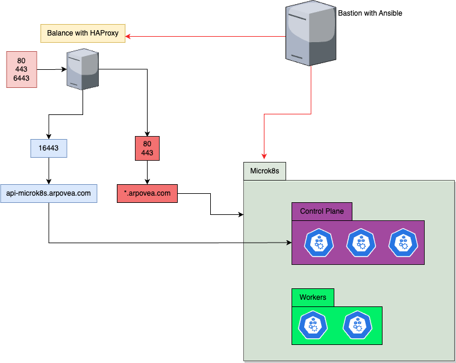

# Despliegue de Microk8s con Ansible

Con este playbook podrás porvisionar un cluster de microk8s ademas de un balanceo con HAProxy para balancear la api de kubernetes y las aplicaciones que quieras exponer en el cluster.

En la siguiente imagen se muestra un diagrama donde se ve la infraestructura final que se provisiona desde un bastión con ansible.

Se recomiendan las siguientes MV:

- 3 Control Planes
- 2 Workers
- 1 Balance con HAProxy

> [!NOTE]
> Adicionalmente se necesitará una máquina desde la que lanzar ansible.

Cada rol de este playbook tiene su propio README que explica su funcionamiento y variables:

- [Initial Setup](https://github.com/arpovea/microk8s-ansible/blob/main/roles/initial_setup/README.md)    
- [Microk8s Init](https://github.com/arpovea/microk8s-ansible/blob/main/roles/microk8s_init/README.md)
- [Microk8s Join](https://github.com/arpovea/microk8s-ansible/blob/main/roles/microk8s_join/README.md)
- [ArgoCD](https://github.com/arpovea/microk8s-ansible/blob/main/roles/argocd/README.md)
- [Tekton](https://github.com/arpovea/microk8s-ansible/blob/main/roles/tekton/README.md)
- [Haproxy](https://github.com/arpovea/microk8s-ansible/blob/main/roles/haproxy/README.md)
- [Test Sonoybuoy](https://github.com/arpovea/microk8s-ansible/blob/main/roles/sonobuoy/README.md)
- [Test Kube bench](https://github.com/arpovea/microk8s-ansible/blob/main/roles/kube_bench/README.md)